# covidplotter

This tool allows easy plotting of scaled transformations of COVID-19 time series data provided by CSSE at John Hopkins University (<https://github.com/CSSEGISandData/COVID-19>).

The tool checks a local clone of the time series data for updates and generates new plots, if necessary.

Scaling factors are defined per country in separate JSON configuration files.
The currently provided scaling factors are taken from English Wikipedia.

## Tested requirements

- OS: Raspbian Buster
- GNU bash 5.0.3(1)
- GNU Make 4.2.1
- Git 2.20.1
- Python 3.7.3
    - matplotlib 3

## Installation

```
git clone <repository url>
```

## Usage

```
make
```

Notes:

- In order to change the countries and/or scaling factors, modify the JSON configuration in `etc/scale_map.json`.
- If new configurations are provided, modify `Makefile` accordingly. Run `src/covidplotter.py` for more options.

## Plots

### Confirmed

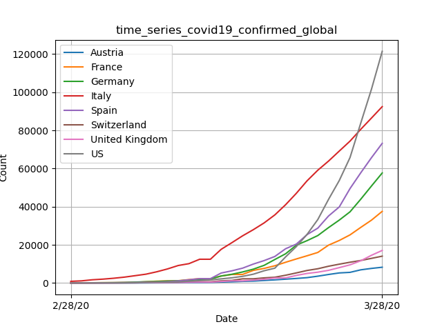

#### Confirmed scaled by population size

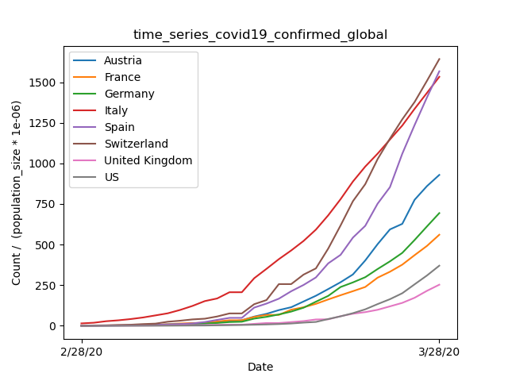

#### Confirmed scaled by population density (per sqkm)

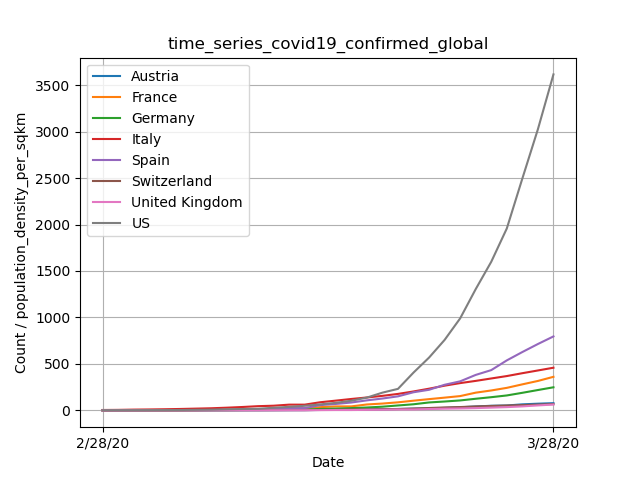

#### Confirmed scaled by median age

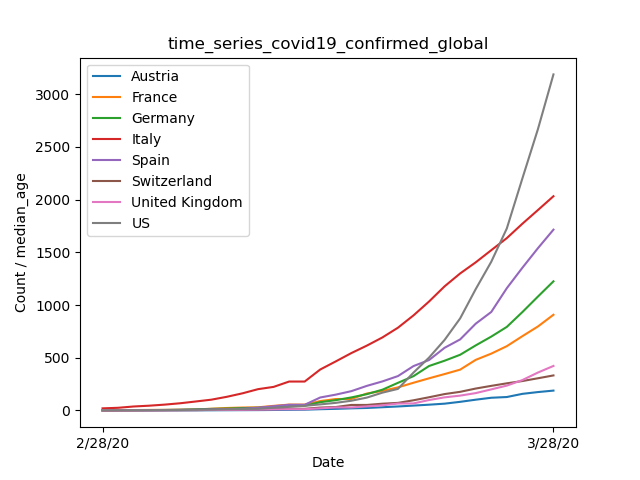

---

#### Confirmed transformed by natural logarithm

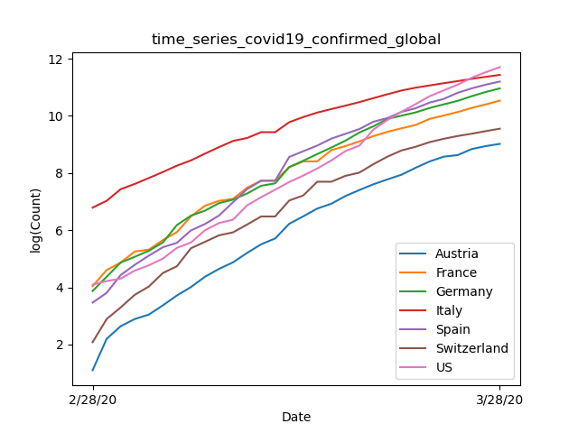
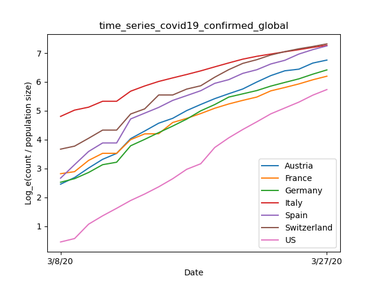

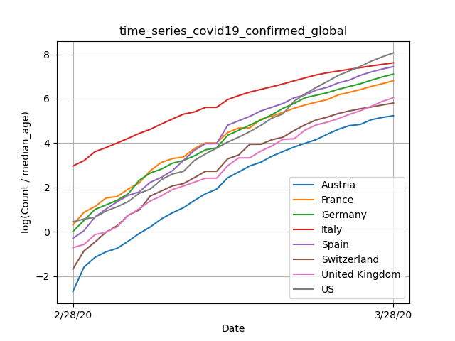

---
---

### Deaths

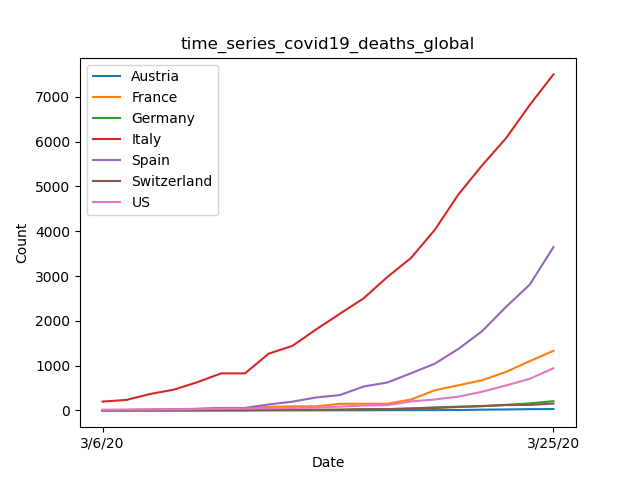

#### Deaths scaled by population size

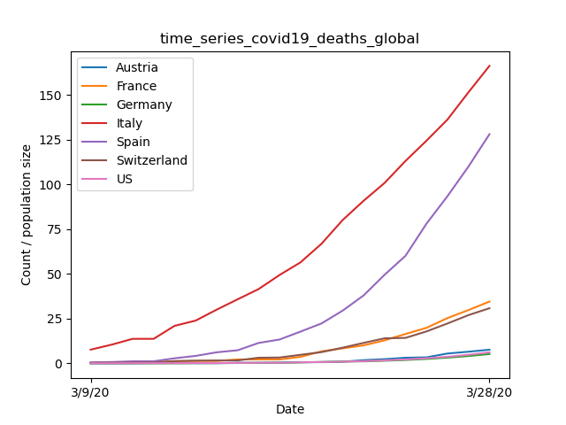

#### Deaths scaled by population density (per sqkm)

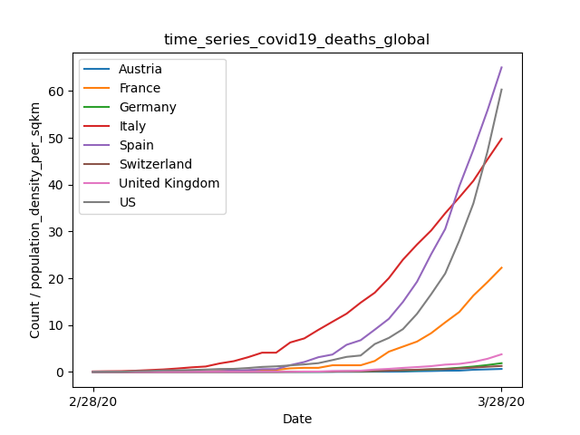

#### Deaths scaled by median age

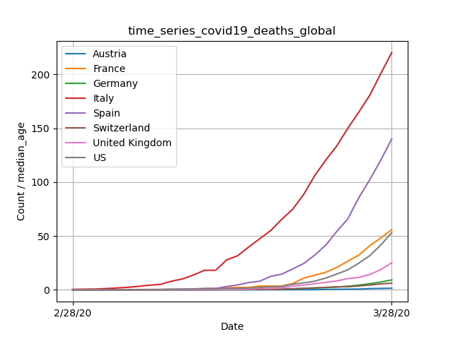

---

#### Deaths transformed by natural logarithm

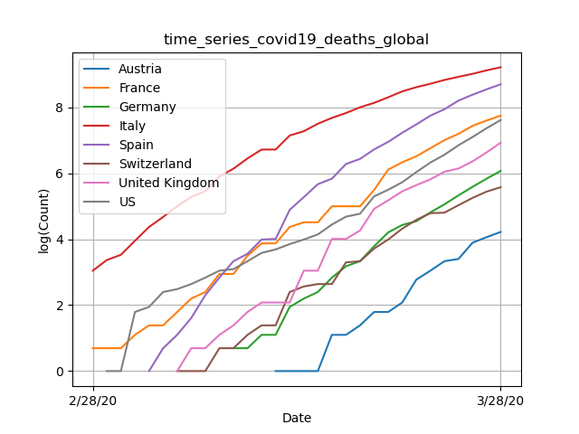
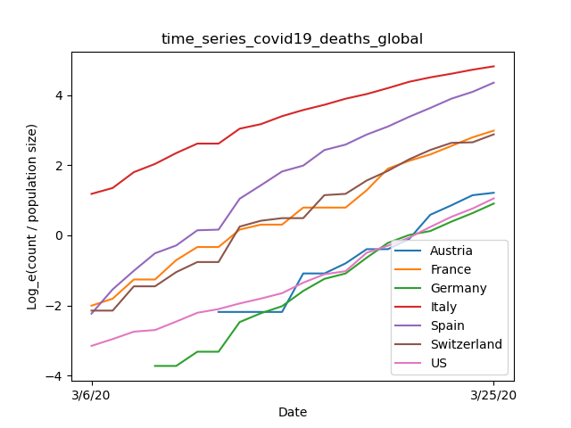
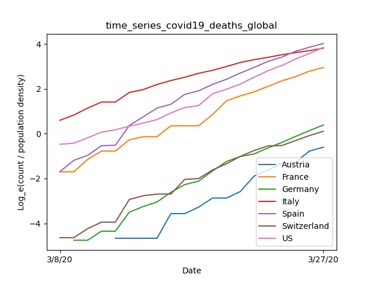
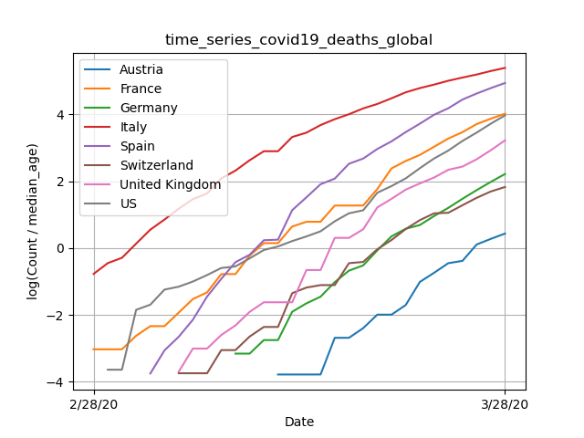

---
---

### Recovered

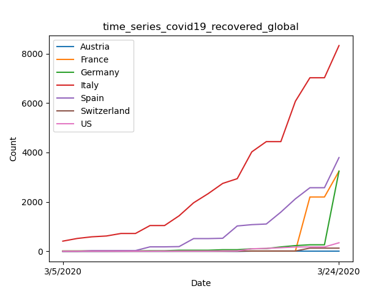

#### Recovered scaled by population size

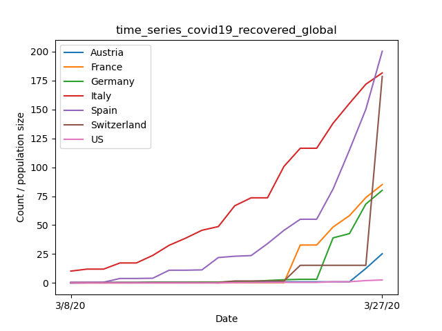

#### Recovered scaled by population density (per sqkm)

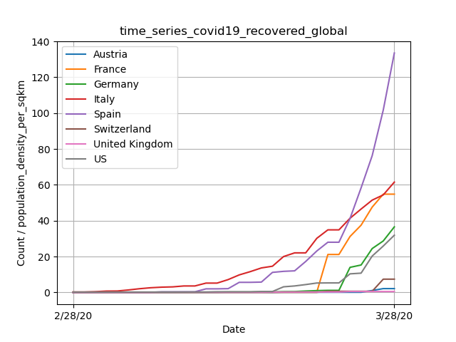

#### Recovered scaled by median age

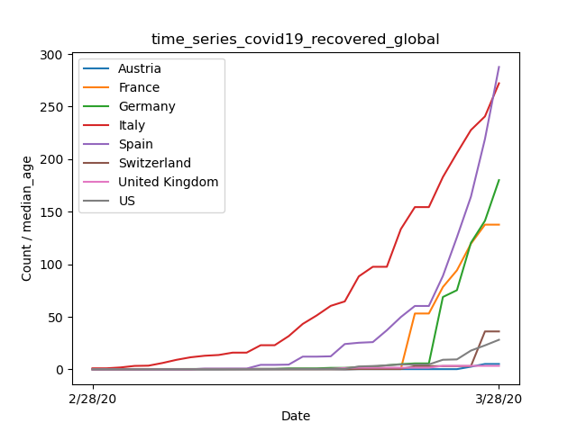

---

#### Recovered transformed by natural logarithm

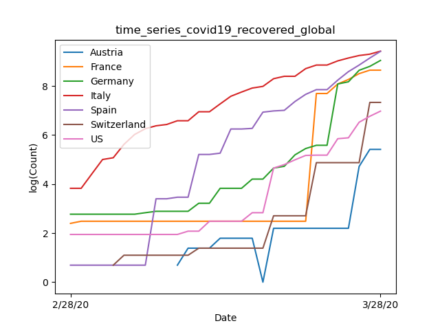
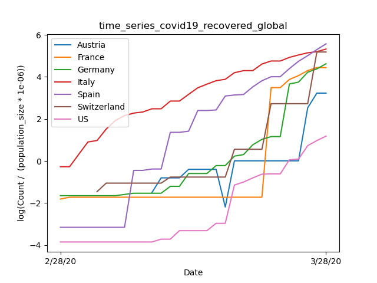
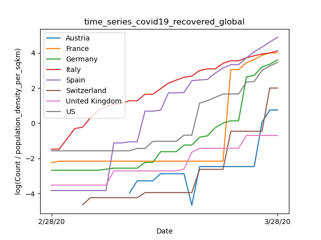

