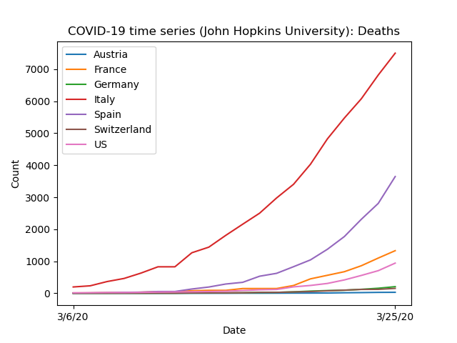
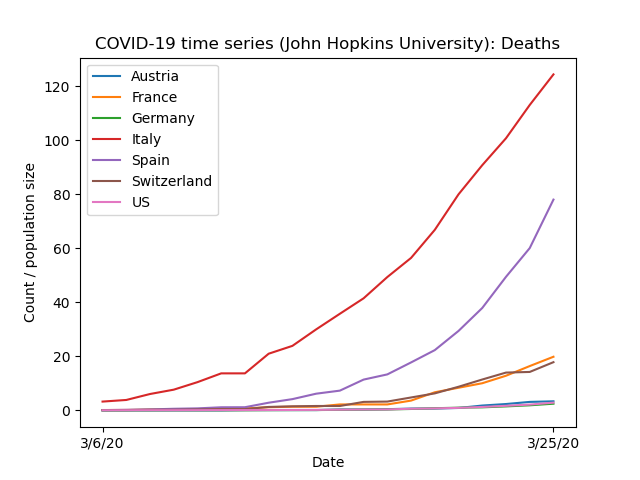
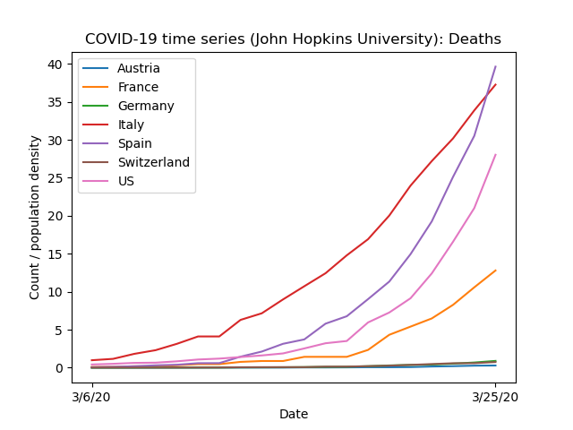
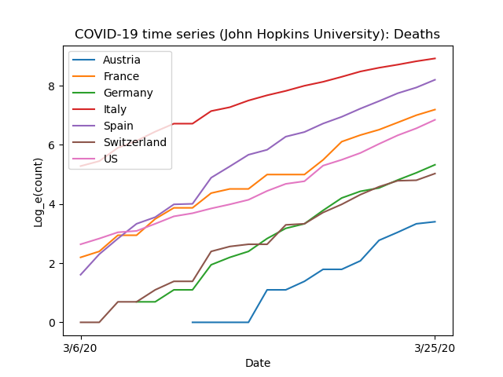
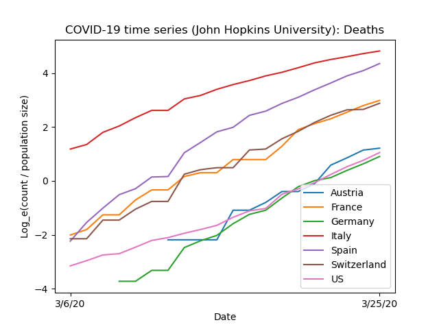
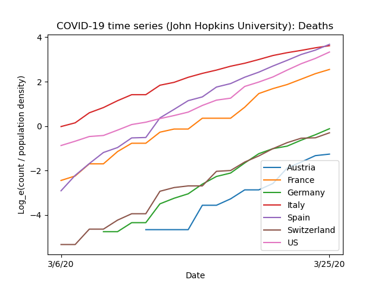

# covidplotter

Maintains a local copy (as git submodule) of COVID-19 time series data (deaths) provided by CSSE at John Hopkins University (<https://github.com/CSSEGISandData/COVID-19>) and plots a subset of them as graphs, as specified by JSON configuration files containing countries and scaling denominators.

Scaling factors (population sizes and densities) are taken from Wikipedia.

## Tested requirements

- OS: Raspbian Buster
- GNU bash 5.0.3(1)
- GNU Make 4.2.1
- Git 2.20.1
- Python 3.7.3
    - matplotlib 3

## Installation

```
git clone <repository url>
```

## Usage

```
make
```

- In order to update to the most current time series data, delete the CSV file and run again.
- In order to change the countries and/or scaling denominators, modify the JSON configurations in `etc/`.

## Plots





---

Log:




