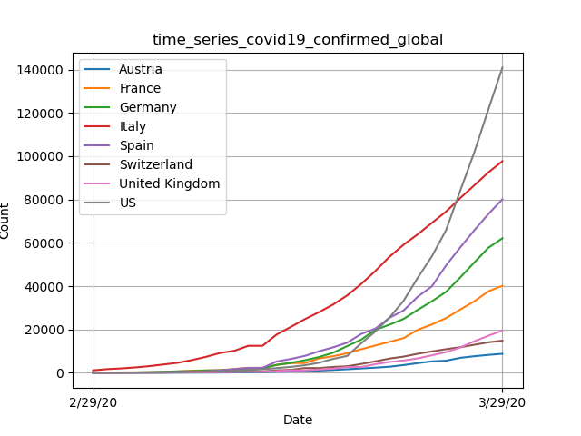
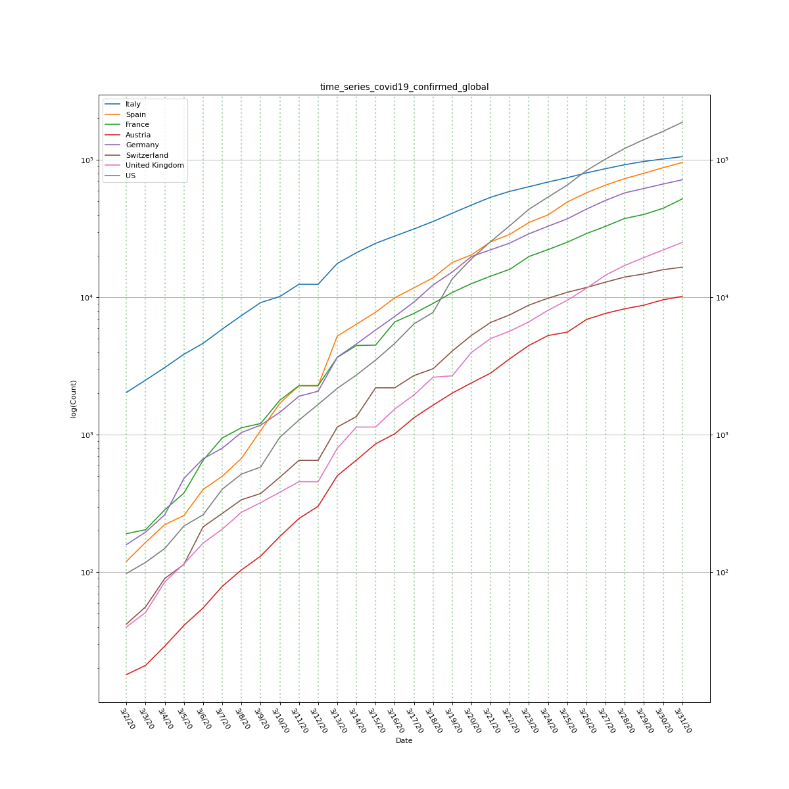
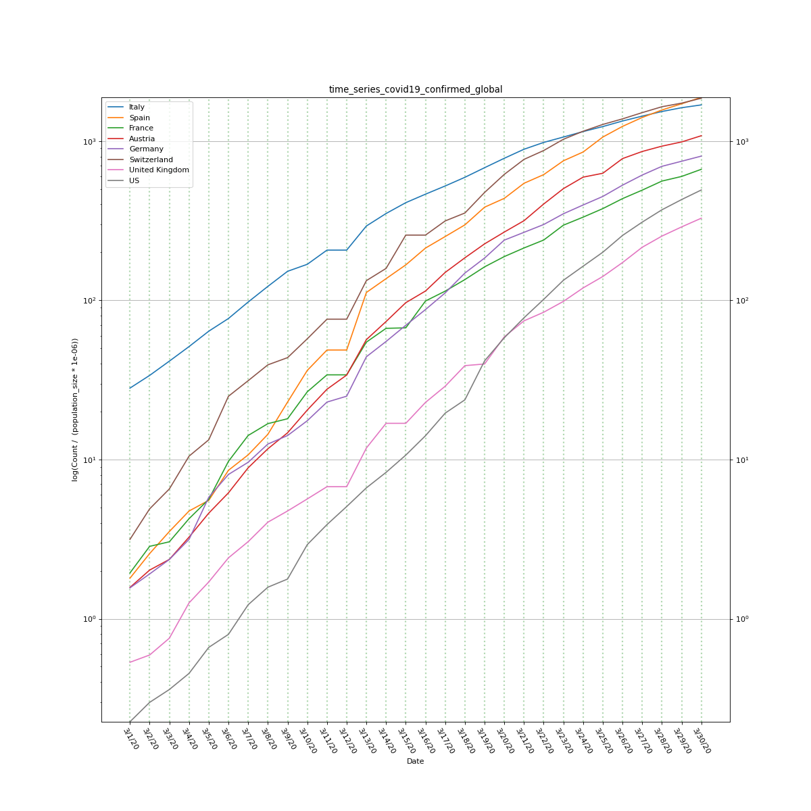
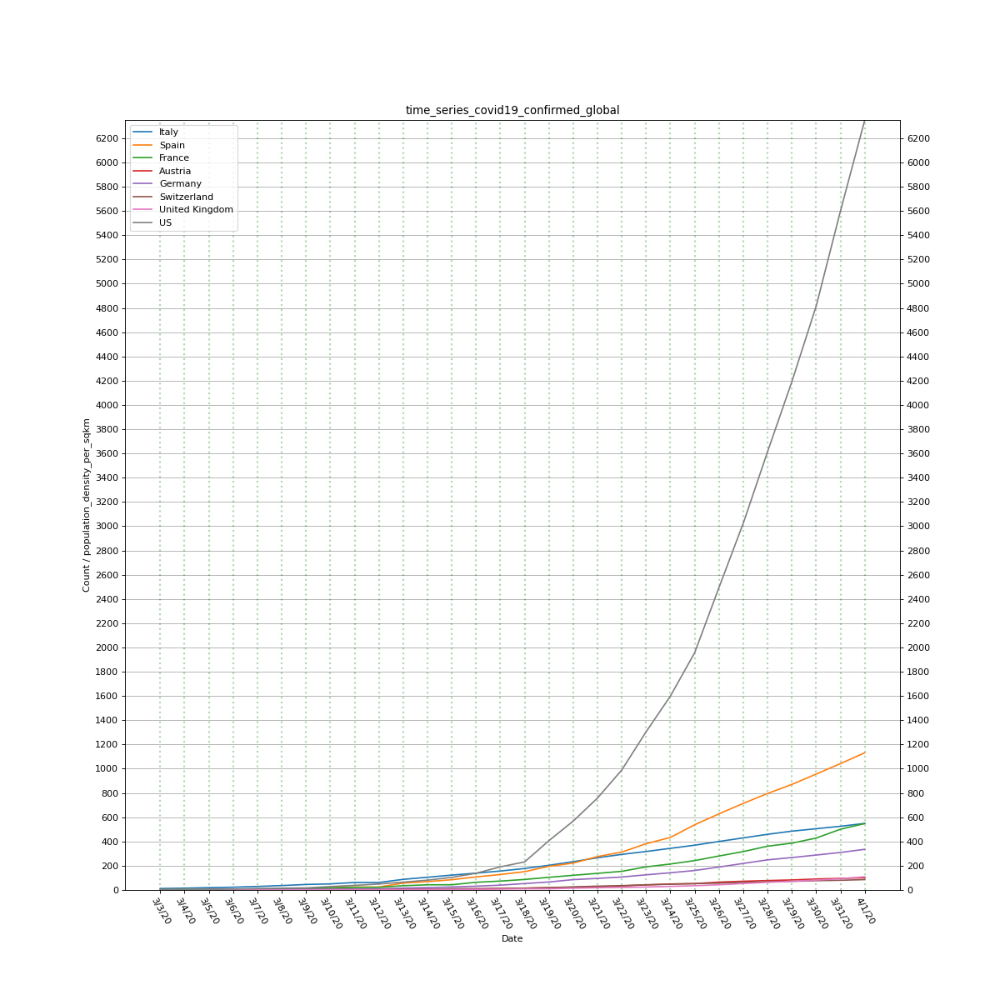
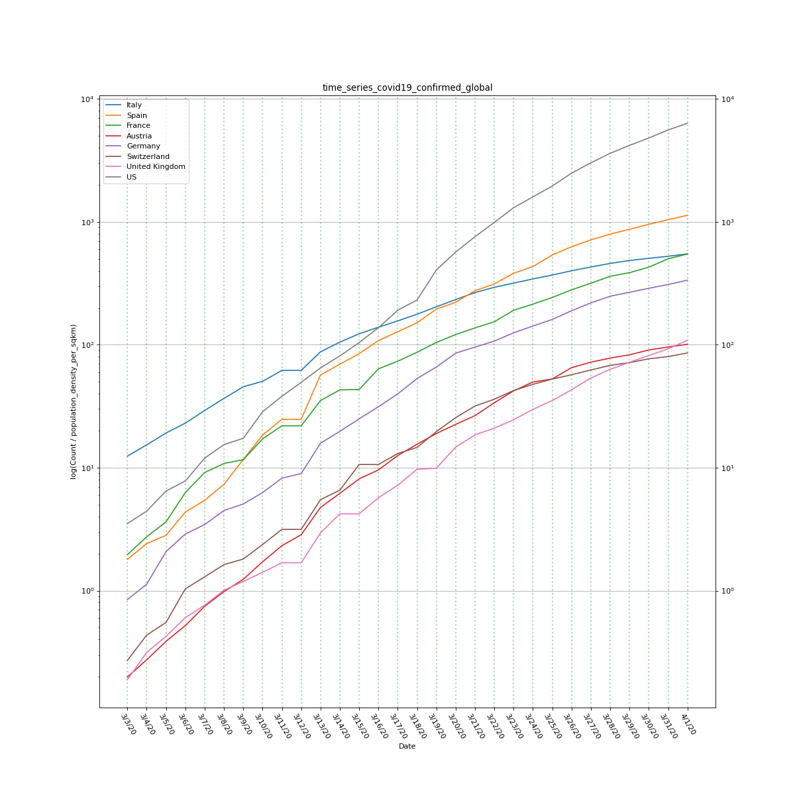
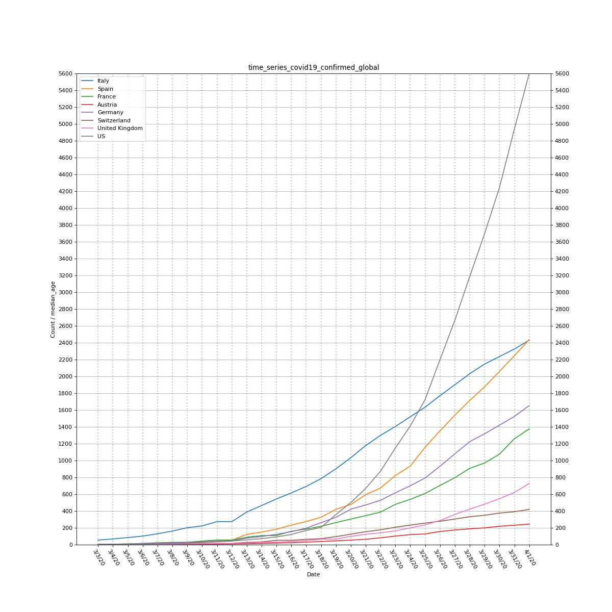
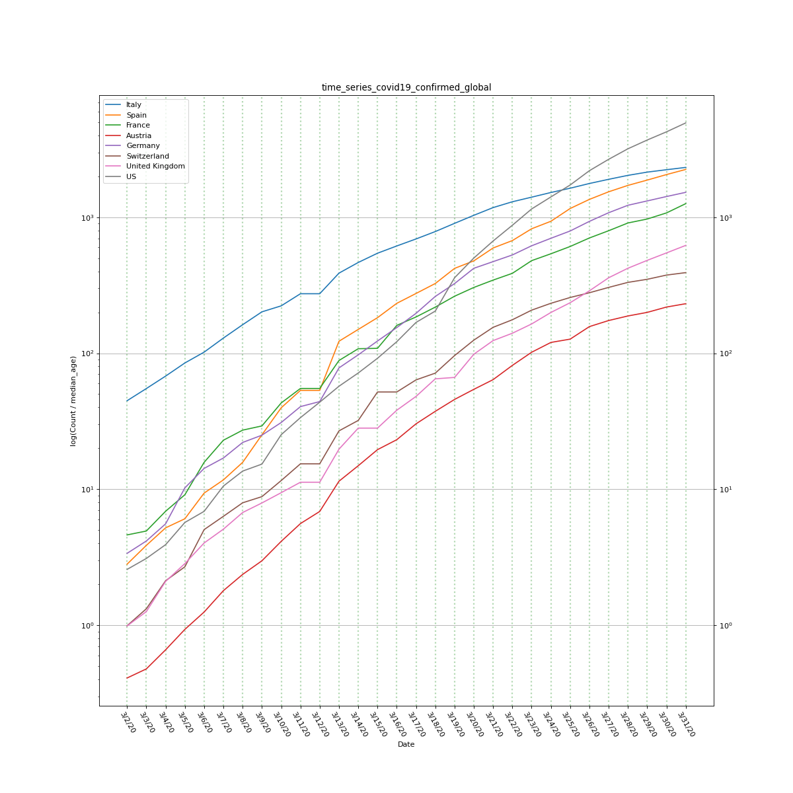
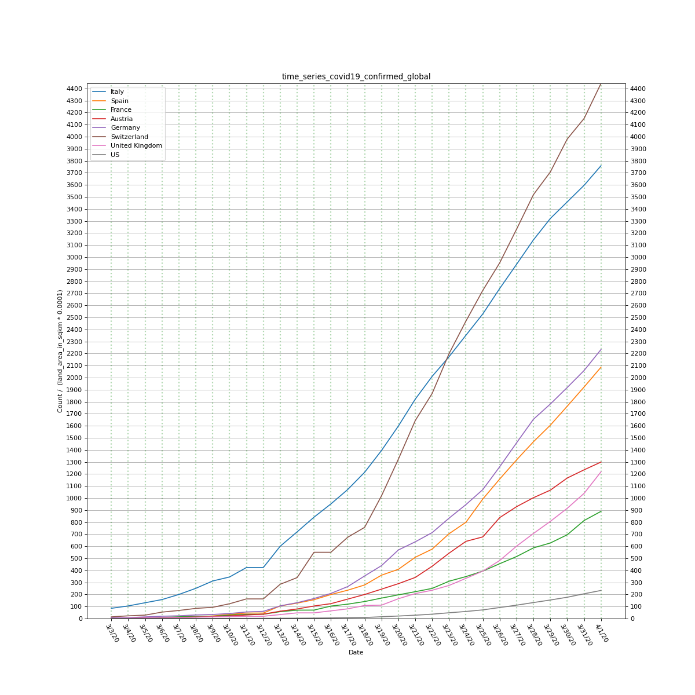

# Plots of COVID-19 confirmed cases

## Confirmed cases scaled by population size

## Confirmed cases scaled by population density (per sqkm)

## Confirmed cases scaled by median age

## Confirmed cases scaled by land area (in sqkm)

