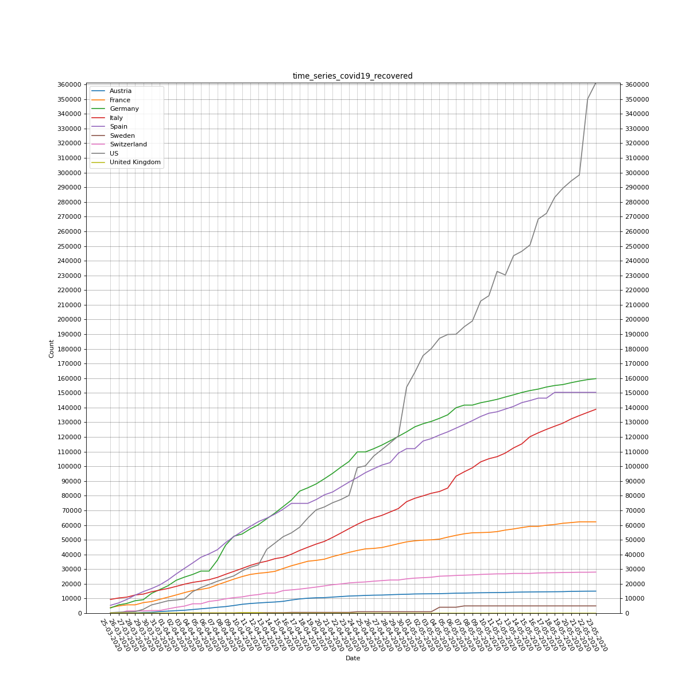
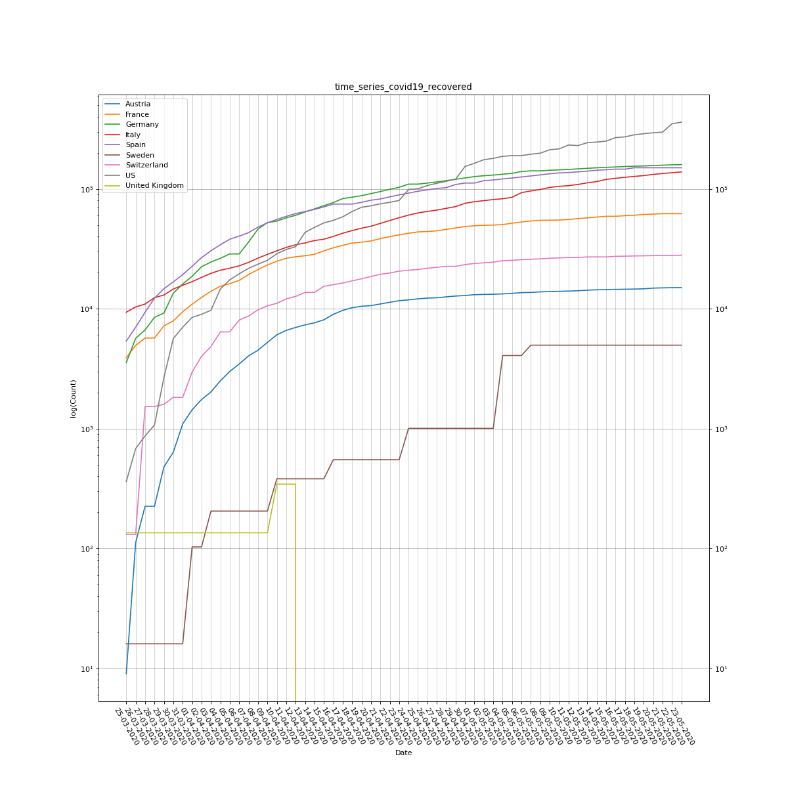
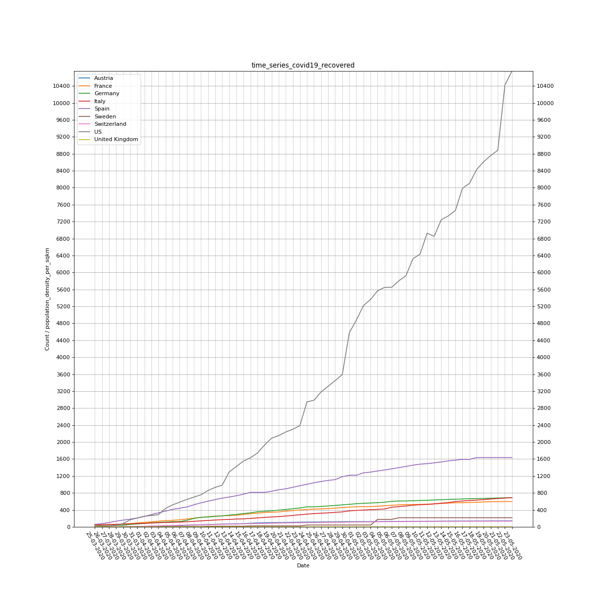
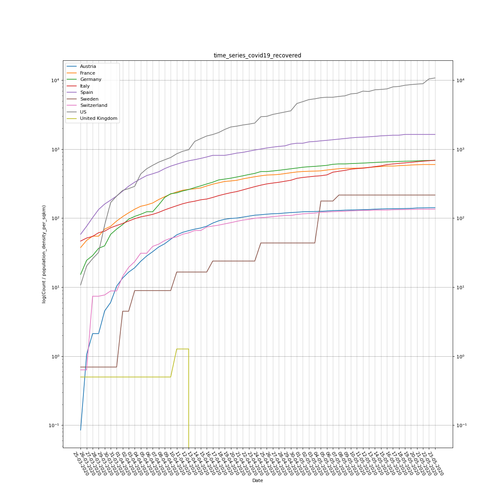
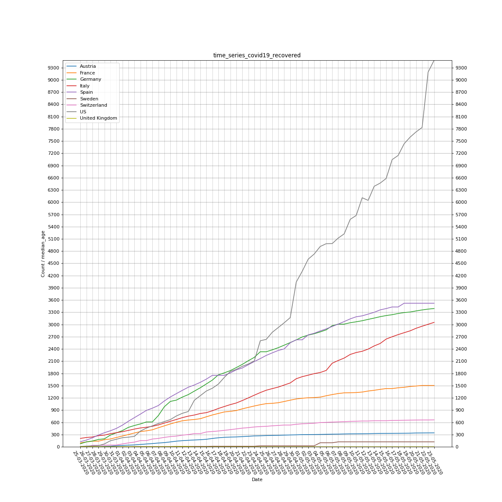
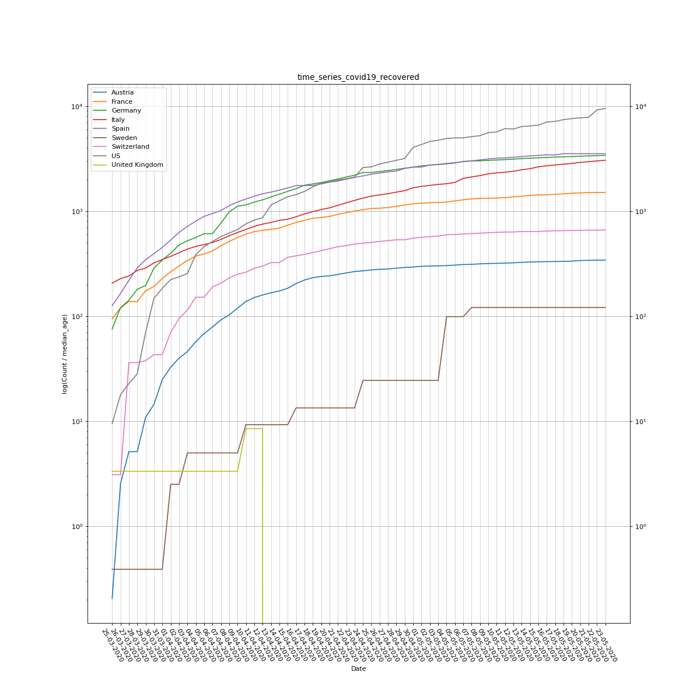
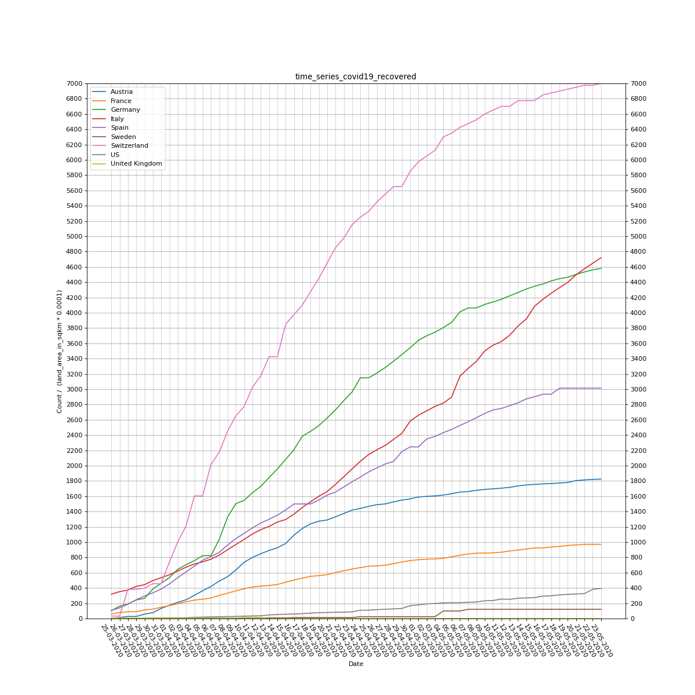
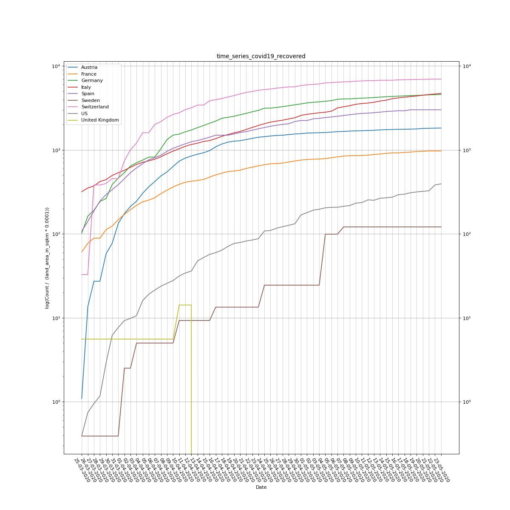

# Plots of COVID-19 recovered

## Recovered scaled by population size

## Recovered scaled by population density (per sqkm)

## Recovered scaled by median age

## Recovered scaled by land area

